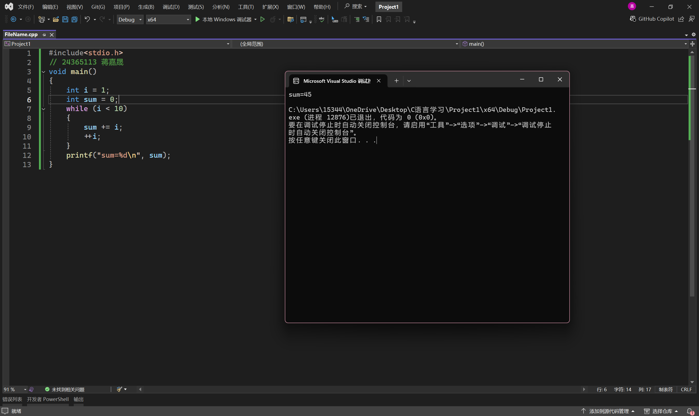
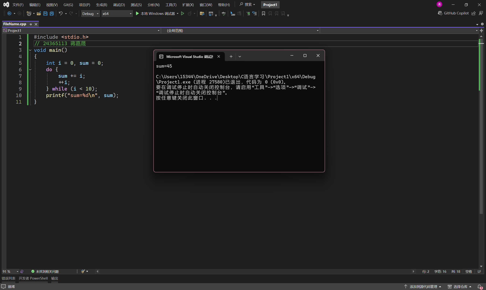
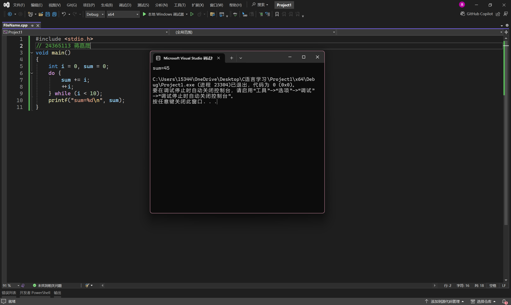
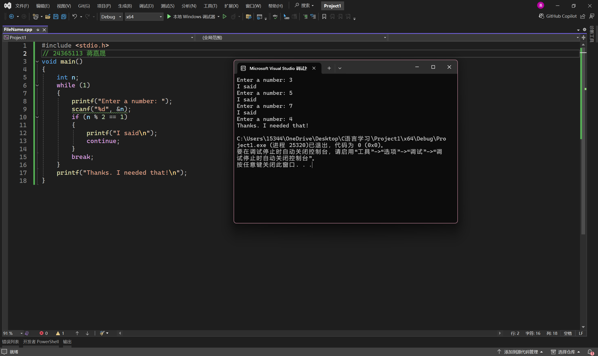

# 实验四 循环结构程序设计


## 一、实验目的

1. 熟悉用while语句，do-while语句和for语句实现循环的方法。
2. 掌握在程序设计中用循环的方法实现各种算法（如穷举、迭代、递推等）。
3. 掌握continue语句和break语句的使用。
4. 熟练掌握循环结构的嵌套。
5. 练习调试与修改程序。

## 二、实验准备

1. 复习while、do-while和for语句的特点和适用条件。
2. 复习break和continue的区别。

##实验内容

以下程序是用来计算S=1+2+3+4+...+10,请更正以下程序的错误，并上机调试。
1.

```
#include<stdio.h>
void main ()
{
	int i=1;
	while(i<10)
	sum+=1;
	++i;
	printf("sum=%d\n",sum);
}
```

修改后

```
#include<stdio.h>
void main ()
{
	int i=1;
	int sum;
	while(i<10)
	{
		sum+=i;
		++i;
	}
	printf("sum=%d\n",sum);
}
```



2.

```
#include <stdio.h>  
void main() 
{ 
int i=sum=0; 
do{ 
sum+=i; 
++i; 
}while (i<10) 
printf("sum=%d\n",sum);
```

修改后

```
#include <stdio.h>  
void main() 
{ 
    int i = 0, sum = 0; 
    do { 
        sum += i; 
        ++i; 
    } while (i < 10); 
    printf("sum=%d\n", sum);
}
```



3.

```
#include <stdio.h> 
void main() 
{ 
int i=sum=0; 
do{ 
sum+=i; 
++i; 
}while(i<10) 
printf ("sum=%d\n" ,sum); 
}
```

修改后

```
#include <stdio.h> 
void main() 
{ 
    int i = 0, sum = 0; 
    do { 
        sum += i; 
        ++i; 
    } while (i < 10); 
    printf("sum=%d\n", sum); 
}
```



4. 输入并运行下面的程序，观察程序的运行结果。

```
#include <stdio.h> 
void main() 
{ 
    int n; 
    while (1) 
    { 
        printf("Enter a number: "); 
        scanf("%d", &n); 
        if (n % 2 == 1) 
        { 
            printf("I said\n"); 
            continue; 
        } 
        break; 
    } 
    printf("Thanks. I needed that!\n"); 
}
```



